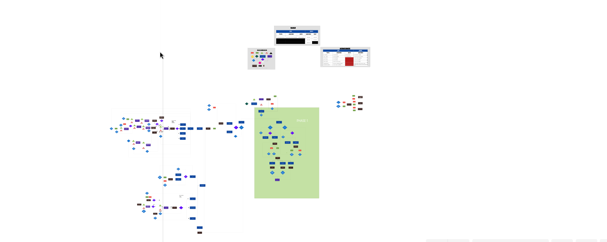

# Student Management System

The Student Management System is a project aimed at assisting in managing student data in an educational institution. This project is built using the C programming language.

## Features

### For Users

- **Registration of new students**: New students can register their information in the system.
- **Academic Records**: Students can view their academic records including midterm exams (UTS), final exams (UAS), assignments (TUGAS), semester GPA, course grades, and cumulative GPA (IPK).
- **Profile**: Students can access and update their personal profile.

### For Admins

- **Search for students based on various criteria**: Admins can search for students using different filters such as name, ID number, etc.
- **Management of student personal data**: Admins can manage and update student personal information.
- **Staff Management**: Admins can manage staff accounts and roles within the system.
- **Academic Management**: Admins can manage academic-related data such as courses, grades, etc.
- **User Account Management**: Admins have the authority to manage user accounts, including permissions and access levels.

## Flowchart

To view the system's flowchart in detail, please [Preview Here](https://cacoo.com/diagrams/aoZuYT59UtRwv4Go/97711).

